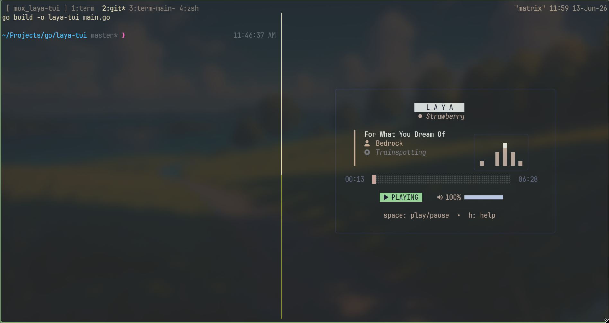
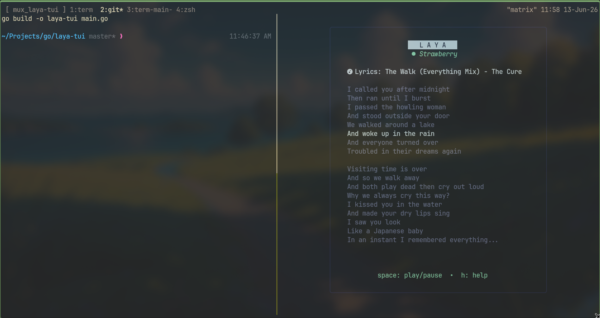
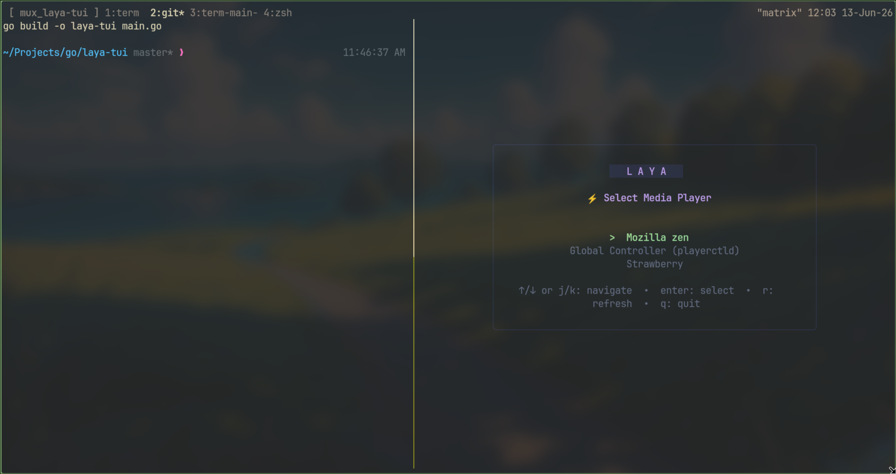
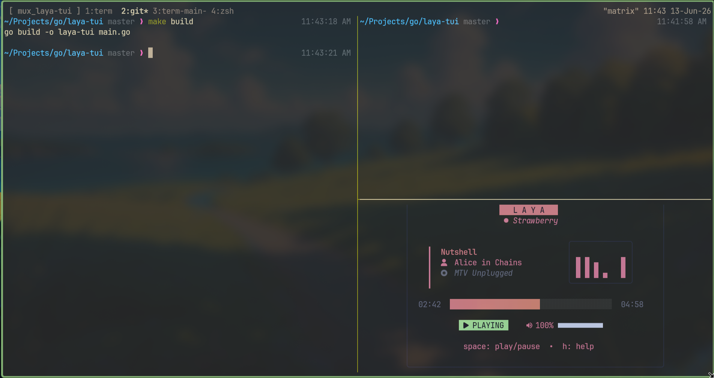

# LAYA

LAYA is a terminal-based MPRIS media controller and "now playing" dashboard for Linux. Built in Go using Bubble Tea, it interacts with running players (like `mpv`, `spotify`, `tauon`, `firefox`, or `vlc`) over the D-Bus session bus.

## Preview

### Dashboard with Wave Visualizer


### Synced Lyrics & Player Selection
| Synced Lyrics | Player Selection |
| --- | --- |
|  |  |

### Mini Player (Responsive Layout)


## Features

- **Adaptive Themes**: Dynamic color extraction from album art (`mpris:artUrl`) via K-means clustering to theme the UI borders and highlights.
- **Synced Lyrics**: Searches local `.lrc` files in the music folder (retrieved from `xesam:url`), falling back to the [LRCLIB](https://lrclib.net/) database. Saves fetched lyrics locally for offline caching.
- **Status Bar IPC**: Runs headlessly with the `--stream` flag to output single-line JSON optimized for custom status bar modules (e.g., Waybar).
- **Vim Keymaps**: Uses standard Vim keybindings for navigation, scrolling, and player hot-swapping.

## Keybindings

### Main Dashboard
- `[Space]`: Play / Pause
- `[n]` / `[Right Arrow]`: Next track
- `[p]` / `[Left Arrow]`: Previous track
- `[` / `]`: Seek -5s / +5s
- `[l]`: Toggle lyrics view
- `[H]` / `[L]`: Cycle active media player
- `[+]` / `[-]`: Volume up / down
- `[s]`: Switch / select active player
- `[q]` / `[Ctrl+C]`: Quit

### Lyrics View
- `[j]` / `[k]` or `[Down]` / `[Up]`: Scroll lyrics
- `[Space]`: Play / Pause
- `[` / `]`: Seek -5s / +5s
- `[l]` / `[Esc]`: Close lyrics view
- `[H]` / `[L]`: Cycle active media player
- `[q]` / `[Ctrl+C]`: Quit

### Player Selection
- `[j]` / `[k]` or `[Down]` / `[Up]`: Navigate player list
- `[Enter]`: Select player
- `[r]`: Refresh player list
- `[Esc]`: Cancel / back to dashboard

## Waybar Integration

Run `laya-tui --stream` headlessly to output Waybar-compliant JSON:

```json
// waybar config
"custom/laya": {
    "format": "{icon} {}",
    "return-type": "json",
    "escape": true,
    "exec": "laya-tui --stream",
    "on-click": "laya-tui",
    "format-icons": {
        "playing": "",
        "paused": "",
        "stopped": ""
    }
}
```

## CLI Usage

```
Usage:
  laya-tui [flags]

Flags:
  -list             List active media players and exit
  -player <name>    Connect directly to player by name (substring match)
  -stream           Stream JSON metadata for status bars (e.g. Waybar)
  -version          Print version and exit
```

## Installation

### Prerequisites
- Linux with active D-Bus session bus.
- Go 1.22+

### Quick Install
```bash
go install github.com/Sahas001/laya@latest
```

### Build from Source
```bash
git clone https://github.com/Sahas001/laya.git
cd laya-tui
make build
# Binary is built as ./laya-tui
```
